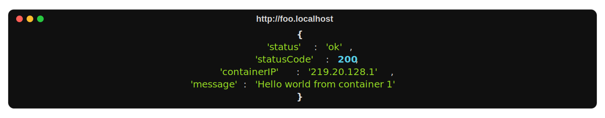

<div align="center">
<h1>Docker Local Subdomain</h1>



</div>

Ever had a hard time remembering the port numbers of different services in your local
[Docker](https://docs.docker.com/) stack? This example demonstrates how you can access
the services via `<subdomain>.localhost` instead of `localhost:<port>`.

*This is a simple node stack running two [Express](https://expressjs.com/) servers in two
different containers. You can access the sevices via `foo.localhost` and `bar.localhost`
respectively. Here, [Caddy](https://caddyserver.com/) is used as a reverse proxy to
direct the requests to the appropriate containers.*

## Prerequisites

This example assumes that you're running a Unix system with Docker >= 20.10.15, Docker
compose v2, [cURL](https://curl.se/), and [jq](https://stedolan.github.io/jq/) installed.

## Installation

Clone the repo, go to the root directory, an run:

```
make up
```

This will spin up three containers—a single reverse proxy and two application containers.

## Usage

You can make requests to the containers as follows:

```bash
curl -s -X GET http://foo.localhost | jq
```

This returns:

```json
{
  "status": "ok",
  "statusCode": 200,
  "containerIP": "219.20.128.1",
  "message": "Hello world from container 1"
}
```

Similary, you can access the second service as follows:

```bash
curl -s -X GET http://bar.localhost | jq
```

This returns:

```json
{
  "status": "ok",
  "statusCode": 200,
  "containerIP": "219.20.128.2",
  "message": "Hello world from container 2"
}
```

Here, the containers have static IPs and you can see that the two requests are handled
by two different containers.

## Todo

* Add caching to the CI.
